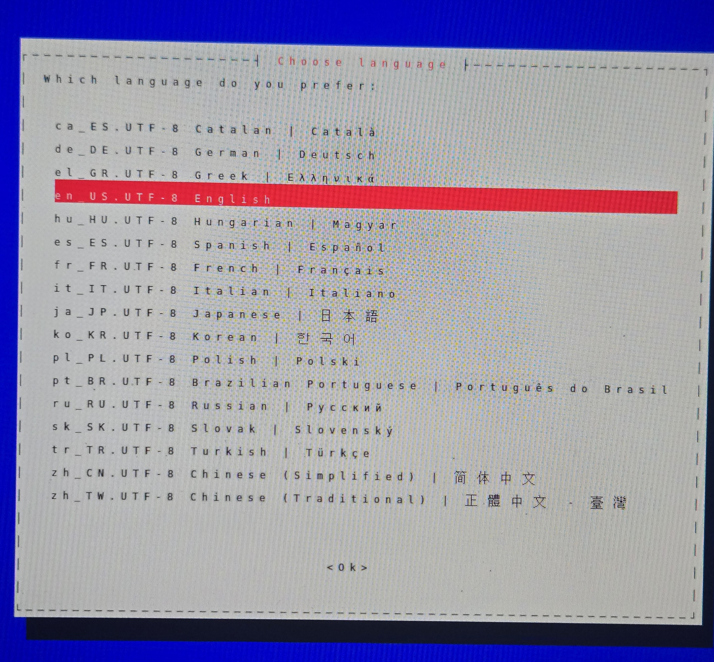
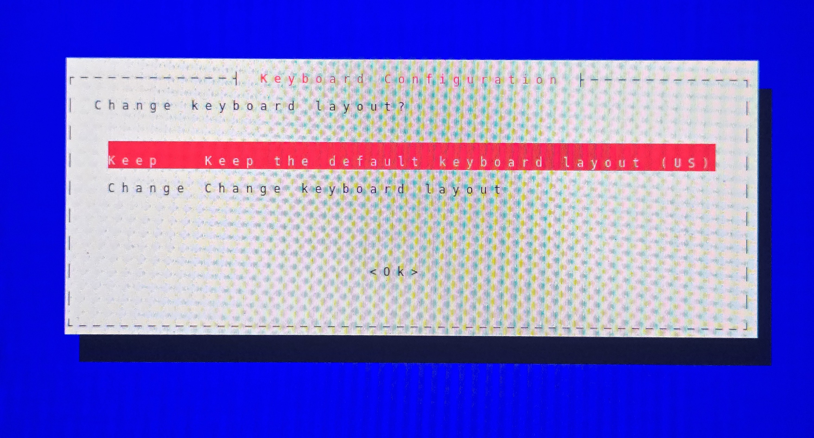
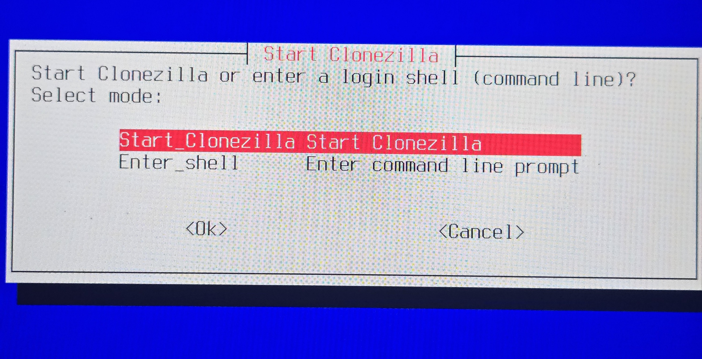
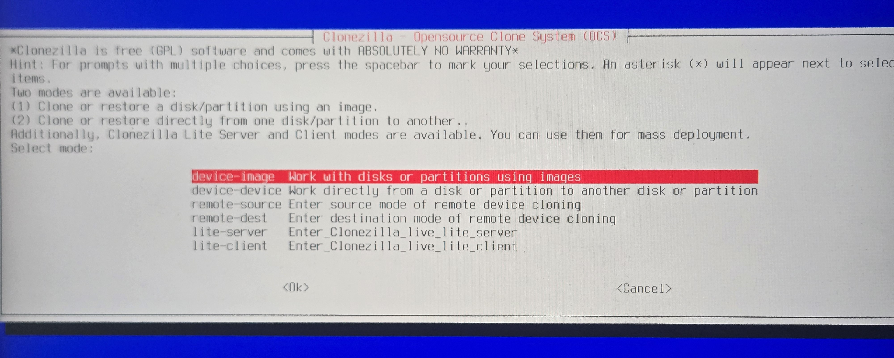
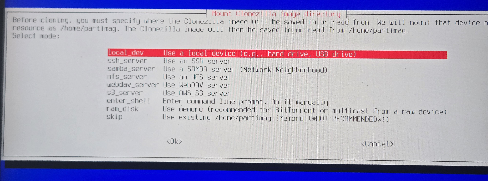

# Instructions
## Overview
- [Instructions](#instructions)
	- [Overview](#overview)
	- [Steps](#steps)
		- [Create clonezilla bootable USB. (on your pc)](#create-clonezilla-bootable-usb-on-your-pc)
		- [Transfer Image to External HDD (on your pc)](#transfer-image-to-external-hdd-on-your-pc)
		- [Update the BIOS settings on the target PC.](#update-the-bios-settings-on-the-target-pc)
		- [Recovering the generalized PC image to target PC.](#recovering-the-generalized-pc-image-to-target-pc)
		- [Complete Windows setup on the target PC.](#complete-windows-setup-on-the-target-pc)

## Steps
### Create clonezilla bootable USB. (on your pc)
1. Download the **clonezilla-live-3.3.1-35-amd64.zip** from shared one drive folder.
2. Plug in a 4/8GB USB drive to your laptop
3. Format the USB drive to fs type **FAT32**
	
4. Extract **clonezilla-live-3.3.1-35-amd64.zip** to the USB drive. The base directory of the USB drive should look as shown below.
	
5. Now you have the bootable clonezilla USB ready! and you can Safely eject the USB drive.

### Transfer Image to External HDD (on your pc)
1. Download **DELL-WIN11-25H2-FTV14-S5000V34-14MAR2026-img** from one drive folder.
2. Extract the zip file to your external HDD.
	
3. Eject and remove the HDD.

### Update the BIOS settings on the target PC.
Press F2 on Dell PC's during booting to enter the BIOS settings and update the following in the BIOS settings.
1. Turn off secure boot
	.jpg)
2. Select AHCI/NvMe for storage driver.
	
3. Save changes and exit (Shutdown).

### Recovering the generalized PC image to target PC.
1. Make sure the laptop/desktop is plugged in.
2. Plug in the Clonezilla bootable USB drive.
3. Turn on the Laptop.
4. Press F12 repeatedly while boot up to bring up the one-time boot menu.
5. Select UEFI USB from the list to boot into Clonezilla.
6. Once GRUB is loaded select **VGA 800X600 & to RAM** to load clonezilla to RAM.
   
   This wll take up to a minute.
7. Once it is loaded you will see the language selection menu. Use arrow keys to select and press enter to confirm.
   
   
   
   
   
8. At this point plug in the **External HDD** with the image. Give it few seconds and you will see list of drives connected to the computer.
   1. You should identify the nvme drive to recover the image to. (if there are multiple drives in the PC)
   2. Also the storage drive containing the image.
   3. In this example they are 
      1. nvme0n1
      2. sdb
   
9. Press **Ctrl+C** to proceed.
10. When you are asked to mount a storage device, mount the external HDD.
   
   
11. When are asked to select the directory containing the image, use tab to select Done and press Enter. No need to change this since the folder containing the image is placed in the base directory.
   
12. Type **n** and press Enter when asked if you would like to synchronize time.
   
13. Select beginner mode and proceed
   
   
   
14. Select the correct nvme drive to restore the image to. *(#refer step 8)*
   .jpg)
   
   
   
   
15. Press Enter to continue and when you are asked confirm overwriting the drive type **y** and press Enter. It amy ask you a couple of times.
   
16. Wait for partclone to finish recovering the image to the drive. It may take about **5 minutes**. After it is finished please follow the on-screen prompts to power off the system.
   

### Complete Windows setup on the target PC.
1. Power on the computer. If it fails to boot, power off and power back on. Press the F12 key repeatedly to enter the one-time boot menu and select the nvme drive to which the image was written to.
2. Follow first time boot setup on Windows.
3. You do not need to connect the computer to internet until you reach the desktop. You will have the **I don't have internet** option to setup a local account.
4. Once the desktop is loaded, open the following file.
	`C:\Users\Public\FATnotes.txt`
	This document contains the instructions to complete the windows setup of the image. Important ones are **renaming the PC** and reconfiguring the **factory talk directory**.